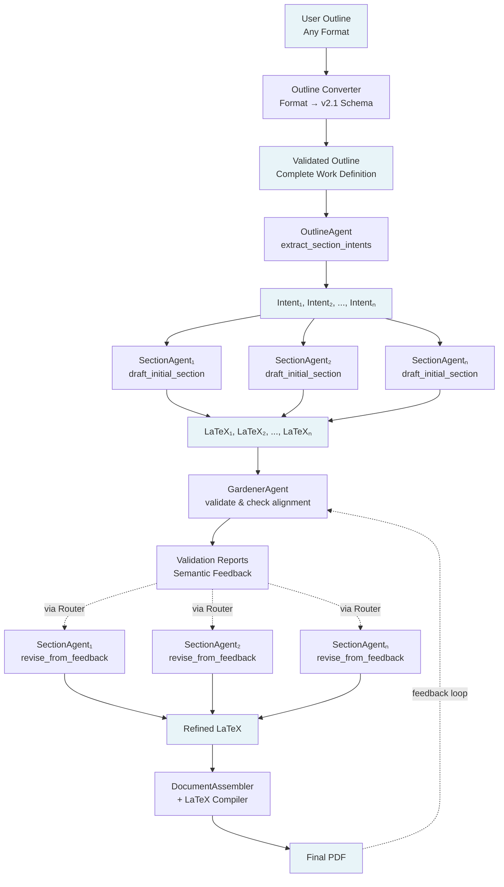
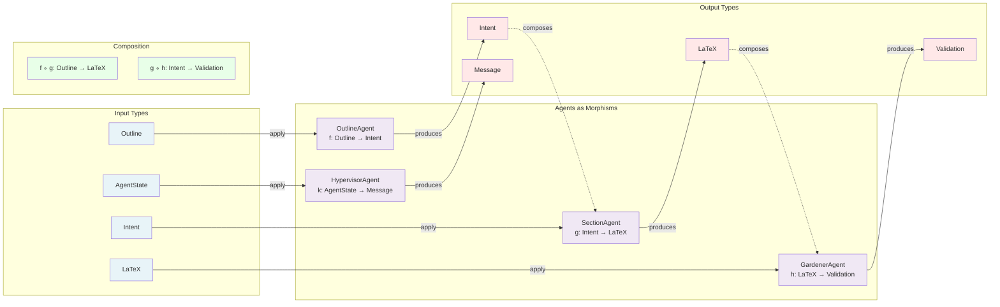
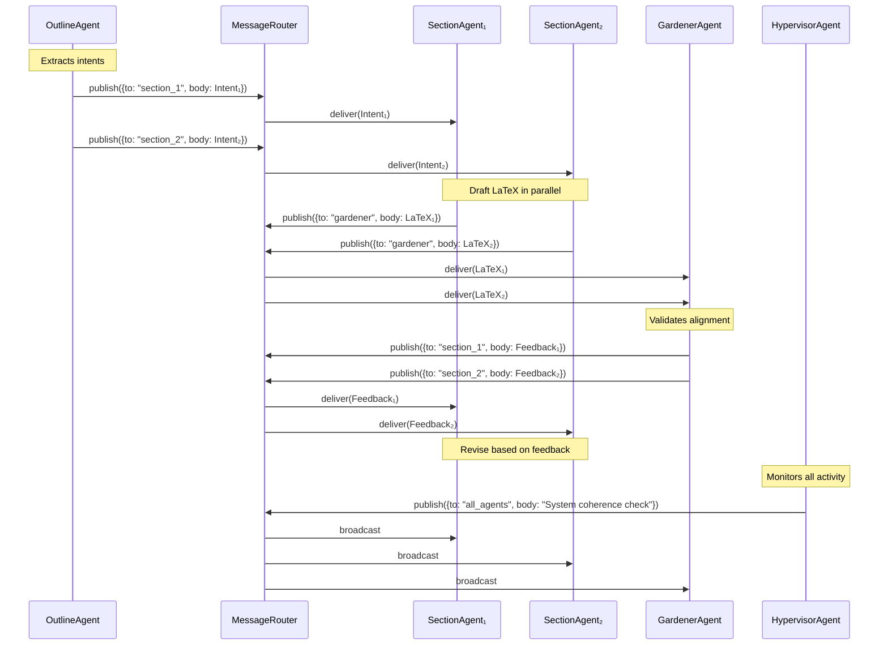
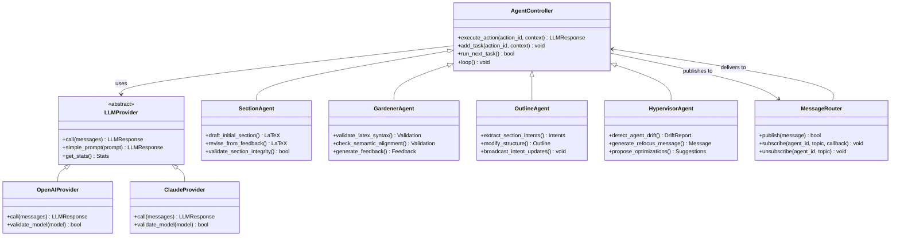
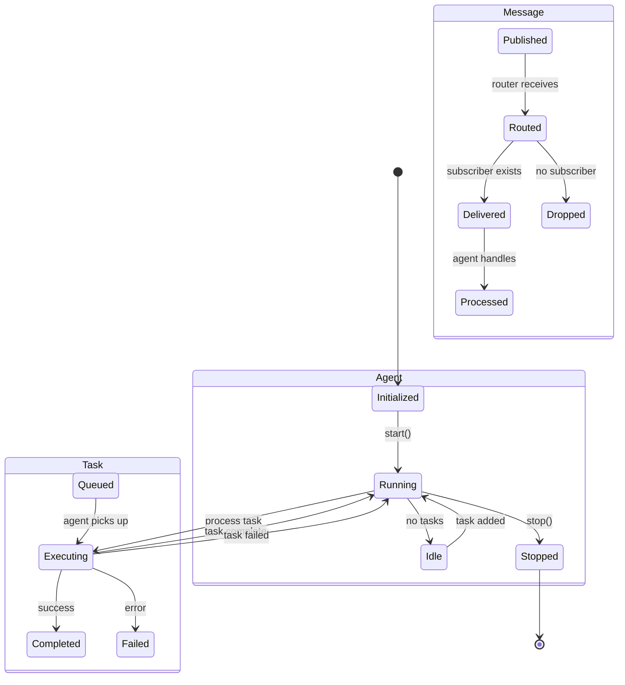
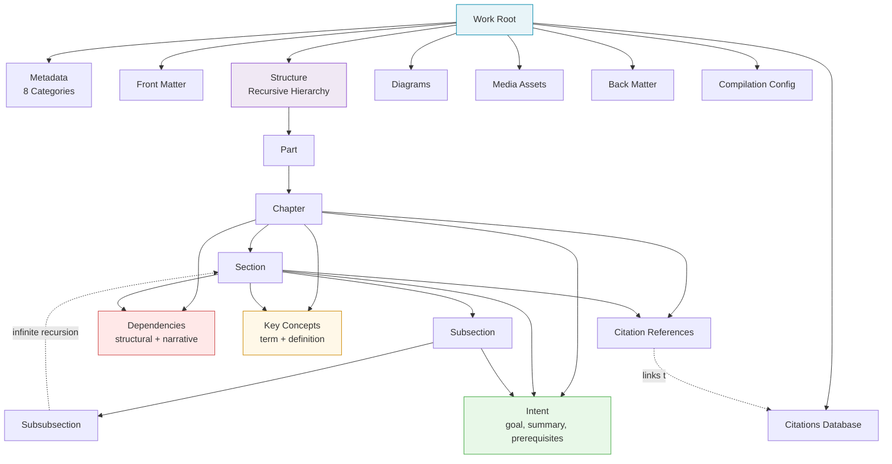
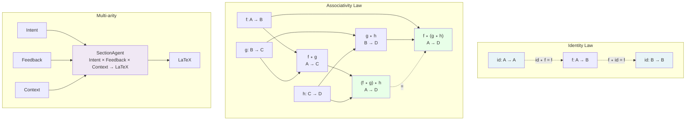

# Operadic Composition Diagrams

This document contains Mermaid diagrams that visualize the functional architecture of the Codynamic Book Machine. These diagrams can be rendered directly in GitHub, VS Code, or any Mermaid-compatible viewer.

## 1. System Layers (Vertical Composition)

```mermaid
flowchart TB
    subgraph Layer6["Layer 6: Compilation Pipeline"]
        Assembler[Document Assembler<br/>Outline × Sections → TeXDoc]
        Compiler[LaTeX Compiler<br/>TeXDoc → PDF]
        Exporter[Multi-Format Export<br/>PDF | HTML | EPUB]
    end
    
    subgraph Layer5["Layer 5: Orchestration"]
        Orchestrator[Agent Orchestrator<br/>Spawns & Coordinates Agents]
        Bootstrap[Bootstrap System<br/>Environment Setup]
    end
    
    subgraph Layer4["Layer 4: Message Router"]
        Router[Message Router<br/>Message → IO Bool]
        Schema[Message Schema<br/>Validation]
        Subs[Agent Subscriptions<br/>Topic-based Routing]
    end
    
    subgraph Layer3["Layer 3: Agent Controller"]
        Controller[AgentController Base<br/>ActionId × Context → Response]
        Section[SectionAgent<br/>Intent → LaTeX]
        Gardener[GardenerAgent<br/>LaTeX → Validation]
        Outline[OutlineAgent<br/>Outline → Intents]
        Hyper[HypervisorAgent<br/>AgentState → Messages]
    end
    
    subgraph Layer2["Layer 2: Provider Abstraction"]
        Provider[LLMProvider Abstract<br/>Messages → Response]
        OpenAI[OpenAIProvider<br/>GPT-4]
        Claude[ClaudeProvider<br/>Claude 3.x]
        Factory[ProviderFactory<br/>Fallback Chains]
    end
    
    subgraph Layer1["Layer 1: Foundation"]
        SchemaDB[Work Outline Schema v2.1<br/>Outline → ValidatedOutline]
        Citations[Citation Database<br/>RefId → Citation]
        State[Agent State Storage<br/>AgentId → TaskQueue × Logs]
    end
    
    Layer1 -.depends.-> Layer2
    Layer2 -.uses.-> Layer3
    Layer3 <-.messages.-> Layer4
    Layer5 -.controls.-> Layer3
    Layer5 -.controls.-> Layer4
    Layer3 ==data==> Layer6
    Layer6 ==feedback==> Layer3
    
    style Layer1 fill:#e8f4f8,stroke:#0088aa
    style Layer2 fill:#fff8e8,stroke:#cc8800
    style Layer3 fill:#f0e8f4,stroke:#8844cc
    style Layer4 fill:#e8f8e8,stroke:#44aa44
    style Layer5 fill:#ffe8e8,stroke:#cc4444
    style Layer6 fill:#f8e8ff,stroke:#aa44cc
```

## 2. Data Flow (Top-Down Creation)



## 3. Agent Composition (Operadic View)



## 4. Message Flow (Inter-Agent Communication)



## 5. Type Hierarchy



## 6. State Transitions



## 7. Dependency Graph (Schema)



## 8. Operadic Composition Laws



---

## How to View These Diagrams

### GitHub
These Mermaid diagrams render automatically in GitHub when viewing this markdown file.

### VS Code
Install the "Mermaid Preview" extension:
1. Open Extensions (Cmd+Shift+X)
2. Search for "Mermaid Preview"
3. Install and restart
4. Right-click this file → "Preview Mermaid"

### Standalone Viewer
Visit [mermaid.live](https://mermaid.live/) and paste the code blocks.

### Command Line
```bash
npm install -g @mermaid-js/mermaid-cli
mmdc -i MERMAID_DIAGRAMS.md -o diagrams.pdf
```

---

## Diagram Interpretations

### Layers Diagram
Shows the vertical composition of the system, with dependencies flowing upward and data flowing downward. Each layer depends on the layer below it.

### Data Flow Diagram  
Illustrates the complete pipeline from user input to final PDF, including the feedback loop where validation results trigger revisions.

### Agent Composition Diagram
Demonstrates how agents are morphisms (functions) that can compose when their types align, embodying the operadic structure.

### Message Flow Diagram
Sequence diagram showing asynchronous message passing between agents via the router, enabling decentralized coordination.

### Type Hierarchy Diagram
Class diagram showing the inheritance relationships and dependencies between core system components.

### State Transitions Diagram
State machines for agents, tasks, and messages, showing the lifecycle of each component.

### Dependency Graph Diagram
The recursive structure of the work outline schema, showing how sections can nest infinitely.

### Composition Laws Diagram
Visual proof of the mathematical properties (identity, associativity, multi-arity) that make the system a valid operad.

---

*These diagrams provide multiple perspectives on the same system, each highlighting different aspects of the functional architecture.*
